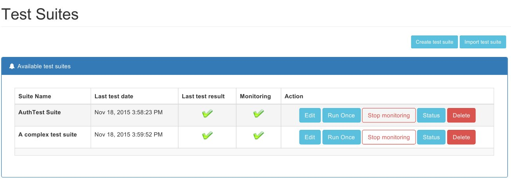

# Configure test suites

The test suites management page allow following operations:

* create test suite
* import create suite from another application
* import all test suites from another application
* edit/delete a test suite
* force run of the test suite
* display status of test suite results
* start/stop automatic test suite execution

## Test suite configuration

### Request parameters
Using this page it can be managed the tests belonging to a test suite. The important parameters to be used are:
* HTTP URL - is selected from a list of available url reported by the mite. This can be changed to match the desired action.
* if the current action requires authentication token. This authentication token is automatically saved from previous requests. The auth token is saved in the context of the test suite, so it is available only in the current test suite execution.
* Body: the body of the requests to be sent. Should be JSON.
* Extend body: another JSON used to extend the current request body. This is mainly useful to modify content of a body that uses variables - see [Chained test suites](./chained-tests.md).

