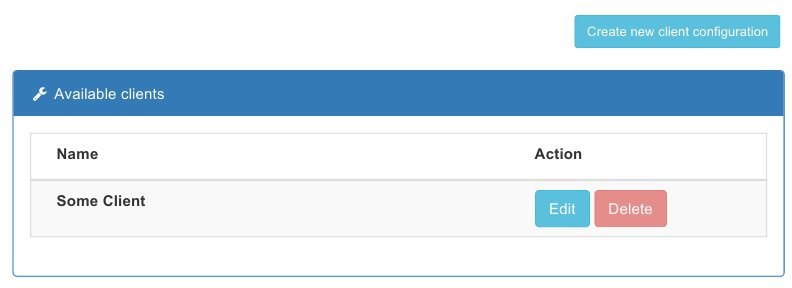

# Define a client

You need to define a client in order to be able to work and monitor with its applications. Each client can have many
application instances installed, such us testing, production, a.s.o. instances. Each of these needs to be monitored
and tested.

The Manage/Client sidebar option menu  can be used to manage the registered clients.

