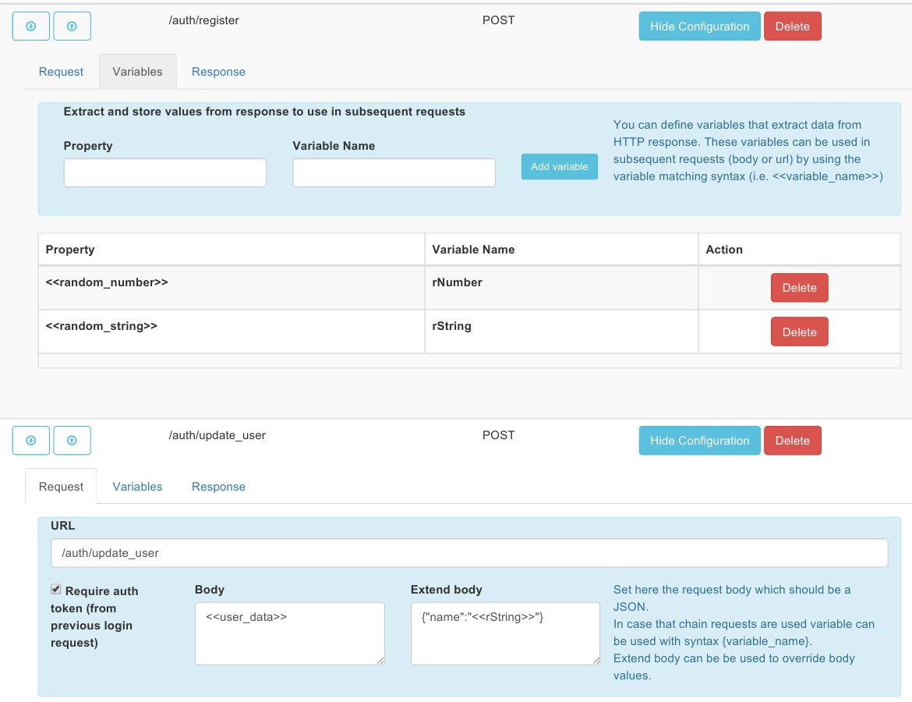
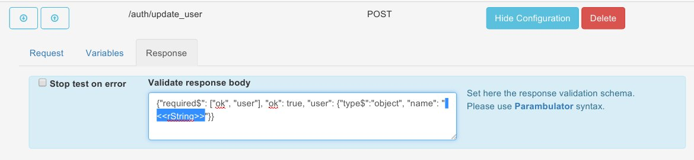

#Dynamic Test Suites

By using response variables there can be defined test suites in which one response data can be used as part of a next request.

The following example shows how dynamic tests can be defined.

First some system variables are defined and for next requests those variables are used to create the request.

Those variables can then be used also in the response validator.

