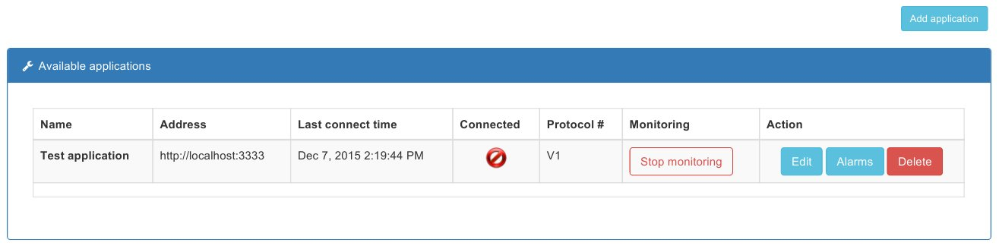

# Start/Stop monitoring a remote application

This can be done from Application management page. In that page is presented a list with application the user can access,
each with status, monitor status, protocol version and administration actions.

