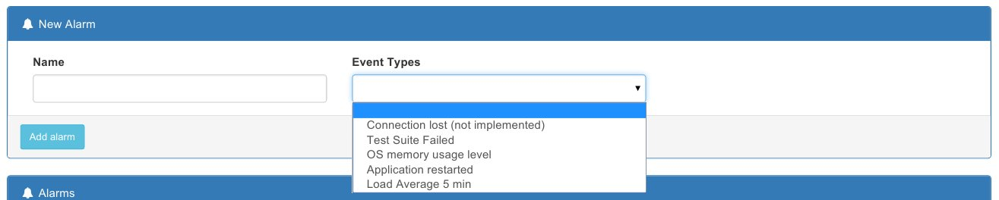
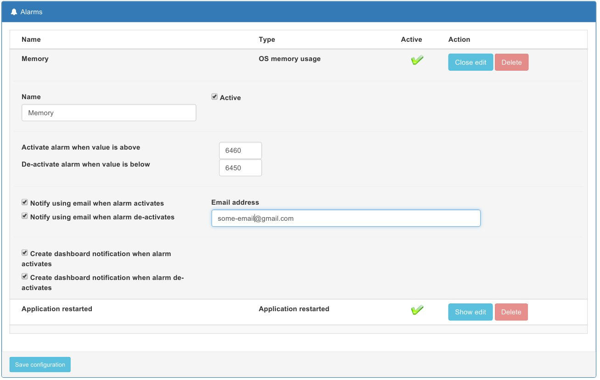

Back to [TOC](./Readme.md)

# Configuring an Alarm

From applications page select Alarm button for desired application. Following page is displayed:

There are some alarm types that can be selected. This list will be increased as new alarms will be implemented.

For each alarm some parameters should be set:
* Name - name of the alarm - will be part of notification
* Active on | off
* Threshold values - in case that alarm is set for a numeric value or true|false for boolean alarm. These values are used to start|stop the alarm
* Notifications: two types of notifications are supported:
  * email notifications
  * dashboard notifications

